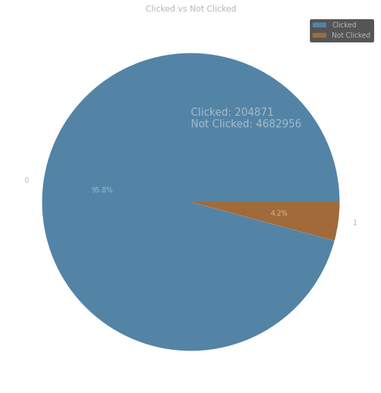
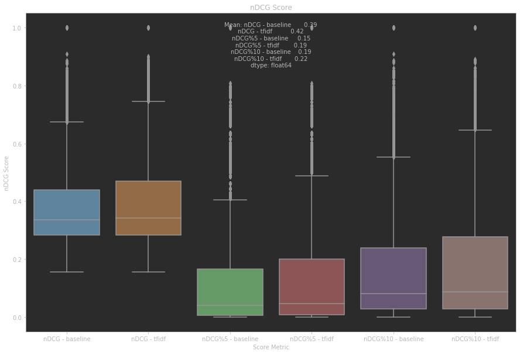
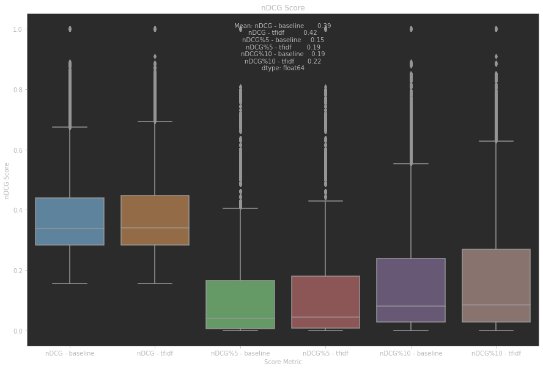
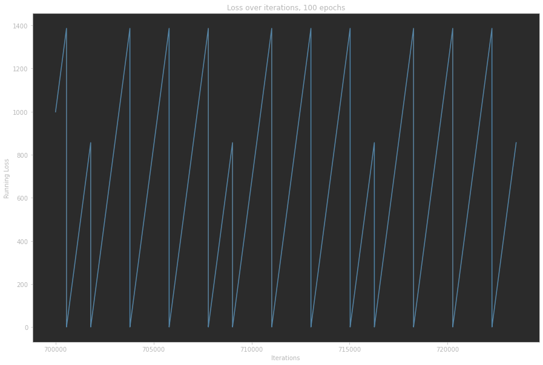
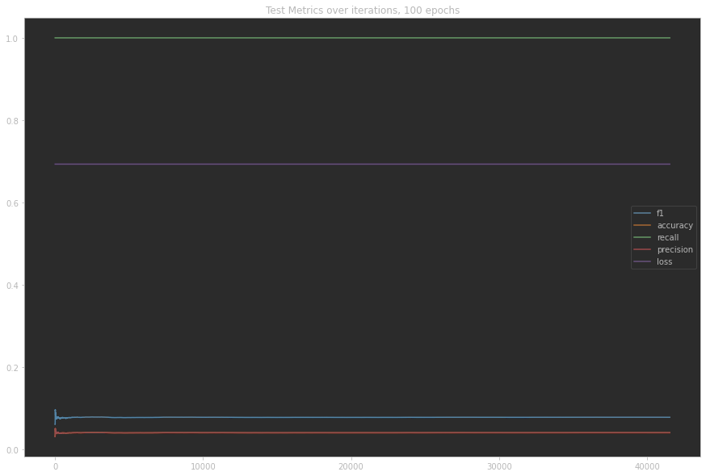
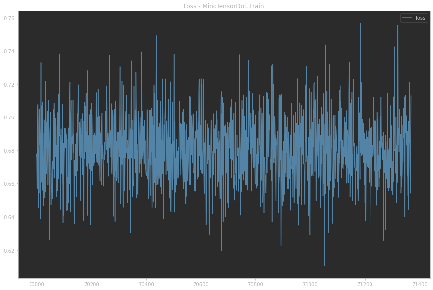
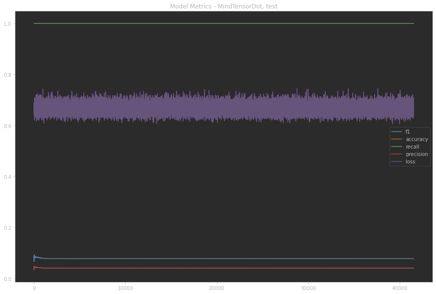

***
# MIND - Deep Learning Recommendation System
***
 

***
> **Authors:**
> - [Guy Dahan](https://github.com/Guydada)
> - [Guy Krothammer](https://github.com/guykrot)
***
> **Submission:**
> - Instructor: Dr. Liron Izhaki Allerhand
> - Course: [Introduction to Search, Information Retrieval and Recommender Systems](https://www.ims.tau.ac.il/tal/syllabus/Syllabus_L.aspx?lang=EN&course=0560416201&year=2021)
> - Semester: October 2021
> - Course ID: 0560416201
> - Faculty: [Engineering](https://en-engineering.tau.ac.il/)
> - Department: [Digital Sciences for Hi-Tech](https://en-engineering.tau.ac.il/BSc-in-Digital-Sciences-for-Hi-Tech)
> - [Tel-Aviv University](https://english.tau.ac.il/)
***


## Requirements
- Python 3.7.6
- PyTorch 1.10
- Anaconda3
- MIND-Dataset (small or full)

## Installation
Clone the repository, and run the following command (in the root directory):
```
$ conda create --name <env> --file requirements.txt
```

The data should be downloaded and placed in the project directory. Create a `data` directory, and `train` `test` directories, place the data from: [download](https://msnews.github.io/) accordingly. 

## Usage
After installation, you can run the following command to activate the environment:
```
$ conda activate <env>
```
Run the following command:
```
$ python main.py
```
For a full list of commands, run:
```
$ python main.py --help
```
After running the code, a prompt will appear asking for mode, choose between:
- 'tfidf' - TF-IDF mode
- 'model' - Model mode

## Abstract
This project is a final submission project in the course: "Introduction to Search,
Information Retrieval and Recommender Systems".The dataset used is the [MIND](https://msnews.github.io/)
dataset by Microsoft. The dataset contains articles from the [Microsoft News](https://www.microsoft.com/en-us/news/) 
and [Microsoft Blog](https://blogs.msdn.microsoft.com/) websites. In addition, the behavior of users (over 2.5 million
users) is also included. The dataset is divided into train, validation and test sets - we will discuss the matter of this
division in the next sections.  
<br>
Furthermore, a "SMALL-MIND" dataset was supplied as well, we chose to use it as our main set for training and testing 
due to time and computational constraints.  
<br>
Our main challenge was figuring out how to represent large amount of text data in a numerical form. We used TF-IDF 
due to its simplicity and efficiency, applying 2 main approaches for recommendation:
<br>
- *A clean TF-IDF approach - Using cosine similarity* 
- *A hybrid approach - using TF-IDF, content based filtering and collaborative filtering*
 <br>

In both approaches, we defined the baseline for the recommendations - the most popular articles by clicks.
We have implemented different metrics for evaluating the quality of our recommendations, mostly we chose to use
nDCG score in order to have a comparable result the existing MIND projects. 

### Coding Standards
The code is written in Python 3.7.6, and is divided into the following modules:
- `main.py` - The main file, which contains the main function.
- `mind.py` - The file that contains the MIND dataset classes.
- `models.net_models.py` - The file that contains the neural network models.
- `models.utils` - The file that contains the utility functions - `tensorize.py`, `load_preprocess.py`, `evaluate.py`.

We have taken a big effort to try and withstand the following:
- [PEP8](https://www.python.org/dev/peps/pep-0008/)
- OOP principles
- Documentation
- Simplicity
- Minimal code duplication using inheritance and composition
- Version control is done using [Git](https://git-scm.com/).


## Define the Problem
The problem we are trying to solve is to recommend articles to users based on their behavior and the articles they 
have read and interacted with. This seemingly simple problem is actually a huge challenge in the field of recommendation.
We think this dataset is especially interesting because it gives us the opportunity to explore both collaborative and
content based filtering approaches.

Additional challenges include:
- How to create the features?
- How much of the data is relevant?
- How to evaluate the results?

## Data
### News Articles
First, let's see some basic exploration of the data. The categories are:


The data itself (referring as mentioned to SMALL-MIND) contains 51282 unique articles, including their categories, subcategories, abstracts, and content. For
a full review of the data's structure, please refer to the
[README](https://github.com/msnews/msnews.github.io/blob/master/assets/doc/introduction.md) in Microsoft News repository.

#### Content and Text 
When applying TF-IDF, we must first "clean" the input data. We have implemented methods for easily choosing the wanted
columns from the dataset for preprocessing, and then they go through the following steps:
- Remove all the punctuation
- Remove all the stopwords
- Remove all the numbers
- Stem the words
- Lemmatize the words

With all the above, the definition of a "stop word" and "punctuation" is from `nltk` library.

### Behaviors 
The data contains the behavior of users (over 2.5 million users) and the articles they have read and interacted with. The
SMALL-MIND contains 50,000 unique users who interacted only with articles that appear in the MIND-SMALL news dataset.

The data is built in a way that presents users and their respective "session" of reading and interacting with articles,
we chose to represent every user as a collection of his complete history combined, while a method for transforming the
data to "sessions" mode is implemented inside the main `Mind` class.

### Data Train-Test Split
The data is split by Microsoft News into train and test sets. The split was done based on collecting data for 4 weeks for
training and 4 weeks for testing.

### Undersampling
We noticed early on that most users just don't interact with articles. Therefore, we decided to undersample the users 
behaviors. Below is the distribution of clicking in the dataset:

## Determining the Baseline
A major question arises:
> How to validate the quality of our recommendations? especially with TF-IDF approach?

We chose to use nDCG score<sup>[1](#footnote1)</sup> , while the baseline is the most popular articles by clicks. 
## Pure TF-IDF
For user representation, we took all the news that appear a user's history, convert them into vectors and calculate the 
mean vector (a csr-matrix)<sup>[2](#footnote2)</sup> . After that we convert all the "impressions" news to csr-matrices.   
join it the user average vector and preform a cosine similarity metric to estimate the distances of each
impression news to user average vector. We sort all the distances in descending order.
```mermaid
graph LR
A[User] -- History --> B(Mean History Vector)
A --Impressions--> C(Impressions Vectors)
B --> D{Cosine Similarity}
C --> D
D --> h(TF-IDF Score)
h --> k(User Labels)
k --> j(TF-IDF nDCG Score)
G(User Click Score) --> k 
k --> i(User Click nDCG Score)
i<-->j
j<--compare-->i 
```
### Performance Metrics
In order to perform nDCG, we compared the TF-IDF top-k with the user's top-k by clicks. We use the actual behavior of the
user - using the labels of the impressions.

### Results - Using TF-IDF on 'title' Only
The results are presented below:

- nDCG - baseline,0.390468
- nDCG - tfidf,0.421797
- nDCG%5 - baseline,0.146443
- nDCG%5 - tfidf,0.186489
- nDCG%10 - baseline,0.186622
- nDCG%10 - tfidf,0.221536



Overall, the performance of TF-IDF is better than the baseline. We also tried to include other columns into 
the TF-IDF, for example: Using TF-IDF on 'title' and 'Category':



as seen above, the category does not contribute much to the TF-IDF score. We also tried
to add the abstract:


Adding the abstract does not improve the results, it actually decreases the performance.
***
## Deep Learning Approach
In this project, we used `PyTorch` library to build a neural network model. Coming to solve this challenge,
We noticed that the main challenge is the representation of users and articles as features. This is complex matter that
we have spent a lot of time to understand, research and implement. If not adjusted, the TF-IDF matrix can be as large as
280,000 and more. First, we had to limit the TF-IDF matrix using `min_df` and `max_df` parameters.

Next, we came up with 2 strategies for building the features for the neural network.
1. Tensor multiplication of the mean history vector and the impression vector - dimensions = `max_features`
2. Tensor dot product of the mean history vector and the impression vector - dimensions = 1
```mermaid
flowchart LR
A[User] --> B(User Vectors)
C[Impressions] --> D(Impressions Vectors)
B --> E{Vector Multiplication}
D --> E{Vector Multiplication}
B --> e{Tensor Dot Product}
D --> e{Tensor Dot Product}
E --n=max_features--> f(User Features)
e --n=1--> F(User Features)
```
### Model Architecture
We chose to implement a fully connected neural network with 1 hidden layers. The hidden layer has `64` neurons. The 
next layer is a ReLU activation function, and the output layer is a linear activation function. The output is 
transformed to a probability distribution using the softmax function. this architecture is rather simple and 
was not derived of complex approach, rather than a result of our reading and research.

### Performance Metrics
Currently, our model supports the standard metrics for evaluating the performance of classification models. We used 
`torch.data.DataLoader` to load the data in batches, and yet the size of the data is very big. Due to time constraints,
we limited the number of epochs to 100 for the first approach and only 10 for the second. In the near future, we plan to implement nDCG metrics for the model, using the 
probabilities given from the neural network.
### Results
#### Tensor Multiplication
This approach resulted in almost no learning. The model was not capable of learning, as shown in the figure below:

As shown, the loss is not converging. We believe this is due to the fact that many users have no relation at all to the 
shown representation of the articles - therefore it contains many zero values, causing the whole feature
vector to be zero. 

#### Tensor Dot Product
This approach was our latest, and we have yet made to make it much better - although the loss might be converging while training.
This leads us to believe that with prolonged training, the model will be able to learn better.



This does not seem much better, yet it was trained for only 10 epochs.




## Conclusions and Next Steps

It is very hard to evaluate the performance of the model since the learning was not converging. Therefore, we don't 
have this type of comparison between the two approaches, the TF-IDF is clearly better currently.
The results are a mixed bag. On one hand, the results of the pure TF-IDF are decent. On the other hand,
the results of the model are very bad. We consider the following conclusions:
- Representation of users history vectors from TF-IDF might not be good for Deep Learning of the type we 
applied.
- A more advanced user embedding might be better, and should be done in comparison with the TF-IDF approach.
- We should apply nDCG metrics to the model, to have a better understanding of the results vs pure TF-IDF.


## Footnotes
- <a name="footnote1">1</a>: While currently implemented fully for TF-IDF, we will be implementing it for hybrid approach.
- <a name="footnote2">2</a>: We use The word "vector" interchangeably, practically speaking, about csr-matrices.
## References
- [MIND](https://msnews.github.io/), by Microsoft
- [Microsoft Recommender Repository](https://github.com/microsoft/recommenders)
- Stevens, E., Antiga, L., & Viehmann, T. (2020).
[Deep Learning With PyTorch](https://www.google.com/search?client=firefox-b-e&q=deep+learning+with+pytorch+). Manning Publications.
- Wu, F., Qiao, Y., Chen, J. H., Wu, C., Qi, T., Lian, J., ... & Zhou, M. (2020, July). [Mind: 
A large-scale dataset for news recommendation](https://aclanthology.org/2020.acl-main.331.pdf). In Proceedings of the 58th Annual Meeting of the
Association for Computational Linguistics (pp. 3597-3606).


